

# Sequence Diagram Basics
## Caleb Werth

---

## Introduction to UML Sequence Diagrams

- **Definition:** UML Sequence Diagrams depict how objects in a system interact over time.
- **Usage:** Useful for visualizing dynamic behavior and message flow.

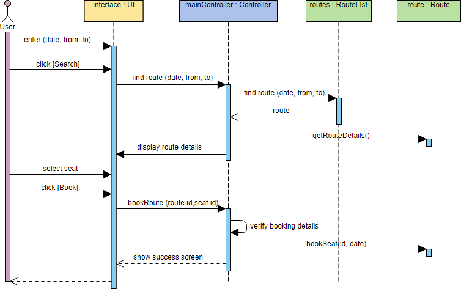

---

## Lifeline

- **Definition:** Represents an individual participant in the interaction.
- **Usage:** Shows object existence over time.
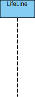

---

## Actor

- **Definition:** Represents a user or system role outside the modeled system.
- **Usage:** Interacts with the system via messages.
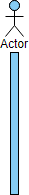

---

## Activation

- **Definition:** Represents the time an object is performing an operation.
- **Usage:** Shown as a solid vertical bar.
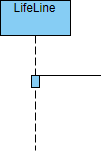

---

## Call Message

- **Definition:** Represents a method invocation from one object to another.
- **Usage:** Indicated by an arrow with a solid line.
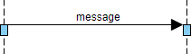

---

## Return Message

- **Definition:** Indicates return of control from a called object to the caller.
- **Usage:** Shown as an arrow with a dashed line.
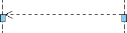

---

## Self Message

- **Definition:** Message sent by an object to itself.
- **Usage:** Arrow looped back to the same lifeline.
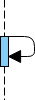

---

## Recursive Message

- **Definition:** Message sent by an object to itself in a recursive context.
- **Usage:** Similar to self message but denotes recursion.
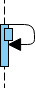

---

## Create Message

- **Definition:** Indicates creation of a new object.
- **Usage:** Arrow with a lifeline at the receiving end.
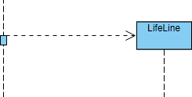

---

## Destroy Message

- **Definition:** Represents destruction of an object.
- **Usage:** Arrow with an X at the receiving end.
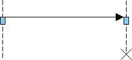

---

## Duration Message

- **Definition:** Shows the distance between two time instants for a message invocation.
- **Usage:** Shown as a solid line at an angle
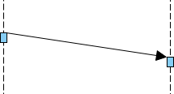

---

## Example Sequence Diagram

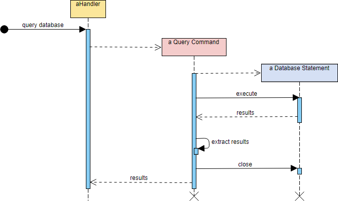

---

## Conclusion

- Sequence Diagrams are powerful tools for visualizing system behavior.
- They facilitate communication and design decisions.
- Mastering them enhances system understanding and collaboration.

---

## Questions?

Any questions?
