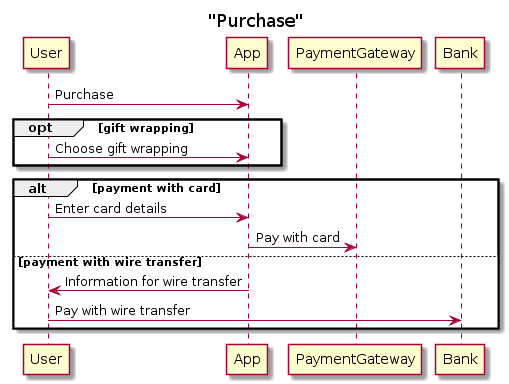
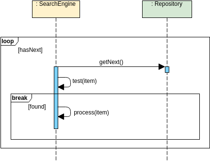

# Sequence Diagram Basics
## Caleb Werth

---

## Introduction to UML Sequence Diagrams

- **Definition:** UML Sequence Diagrams depict how objects in a system interact over time.
- **Usage:** Useful for visualizing dynamic behavior and message flow.

---

## Lifeline

- **Definition:** Represents an individual participant in the interaction.
- **Usage:** Shows object existence over time.

---

## Actor

- **Definition:** Represents a user or system role outside the modeled system.
- **Usage:** Interacts with the system via messages.

---

## Activation

- **Definition:** Represents the time an object is performing an operation.
- **Usage:** Shown as a solid vertical bar.

---

## Call Message

- **Definition:** Represents a method invocation from one object to another.
- **Usage:** Indicated by an arrow with a solid line.

---

## Return Message

- **Definition:** Indicates return of control from a called object to the caller.
- **Usage:** Shown as an arrow with a dashed line.

---

## Self Message

- **Definition:** Message sent by an object to itself.
- **Usage:** Arrow looped back to the same lifeline.

---

## Recursive Message

- **Definition:** Message sent by an object to itself in a recursive context.
- **Usage:** Similar to self message but denotes recursion.

---

## Create Message

- **Definition:** Indicates creation of a new object.
- **Usage:** Arrow with a lifeline at the receiving end.

---

## Destroy Message

- **Definition:** Represents destruction of an object.
- **Usage:** Arrow with an X at the receiving end.

---

## Duration Message

- **Definition:** Shows the distance between two time instants for a message invocation.
- **Usage:** Shown as a solid line at an angle

---

## Alt Box vs. Opt Box

- **Alt Box:**
  - Represents alternative branches in a sequence.
  - Only one branch is chosen based on a condition.
  
- **Opt Box:**
  - Represents optional interactions or conditions.
  - Like a single "if" clause with no "else"

---

## Alt Box vs. Opt Box

---

## Loops and Breaks

- **Loops:**
  - Represent repetitive interactions within a sequence.
  - Allow modeling of iterative processes or repeated actions.
  
- **Breaks:**
  - Interrupt a loop or iteration under certain conditions.
  - Allow modeling of conditions that terminate a loop prematurely.

---

## Loops and Breaks

---

## One More Example Sequence Diagram For Fun

---

## Bottom Line

### Sequence diagrams offer a visual representation of interactions between objects in a system, aiding in understanding system behavior.

---

## Questions?